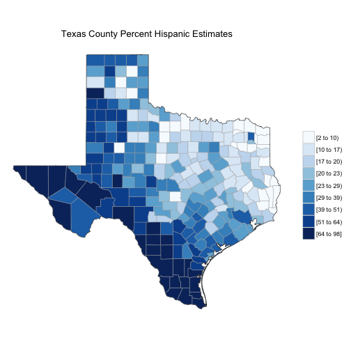

United States Census Data Visualizer
========================================================
author: RK
date: 03/06/2016

========================================================

The United States Census Data is helpful in many ways . Just a few of them are :

- Research Markets
- Prevent diseases
- Locate pools of skilled workers
- Advocate for causes

========================================================

You can now visualize the census data in an easy to click
color coded Map !

========================================================
Like this !

 

========================================================

Learn More :

-
-
- Coursera Data Science Specialization ( Developing Data Products )

========================================================
